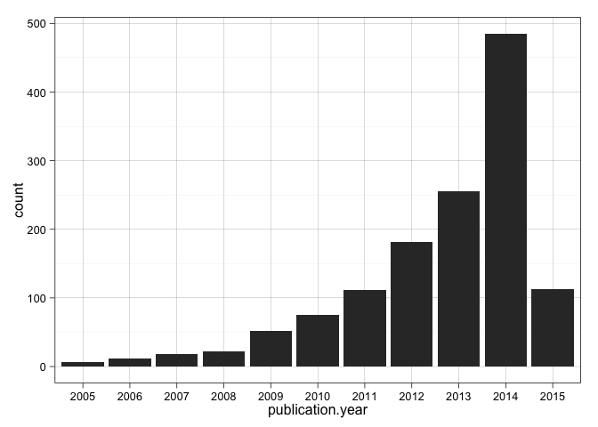

# PRIDE Archive Anual Trends - Exploratory Data Analysis
Jose A. Dianes  
20 March 2015  

## Requisities  

These are some of the libraries and configurations we will use in the 
following analysis.  


```r
require(devtools)
```

```
## Loading required package: devtools
```

```r
install_github("PRIDE-R/prideR")
```

```
## Downloading github repo PRIDE-R/prideR@master
## Installing prideR
## '/Library/Frameworks/R.framework/Resources/bin/R' --vanilla CMD INSTALL  \
##   '/private/var/folders/w5/qxp7hx8j1k19_jflsgynkdv40000gn/T/RtmpNPrzqS/devtools2cf75760ce5/PRIDE-R-prideR-184ed85'  \
##   --library='/Library/Frameworks/R.framework/Versions/3.1/Resources/library'  \
##   --install-tests
```

```r
library(prideR)
```

```
## Loading required package: rjson
## 
## This is prideR version 0.99.0 
##   Read '?prideR' and references therein for information
##   about the package and how getting started.
## 
## 
## Attaching package: 'prideR'
## 
## The following object is masked from 'package:graphics':
## 
##     title
## 
## The following objects are masked from 'package:base':
## 
##     as.data.frame, sequence
```

```r
library(ggplot2)
theme_set(theme_linedraw())
```

## A draft of the pipeline  

The two first parts are carried out in this document. The data visualisation part
will be generated and published separatelly and referenced from here.  

#### Data acquisition

We will use the [prideR package](http://pride-r.github.io/prideR) to retrieve 
data from all the submitted experiments up to date.  

#### Exploratory Data Analysis  

By using `R`, first we will prepare and explore data to be mined. Then we will
compute different summary statistics and generate some plots that will give us
some insight into the questions we want to answer in our visualisation.  

#### Data Visualisation  

For this data viz we will use [Tableau](http://www.tableau.com). We will generate some worksheets for the 
key charts, and then we will put them together in an *author-driven* linear
narrative that will go over time answering questions about MS2 proteomics 
research trends.  

## Data acquisition  

Using [prideR](http://pride-r.github.io/prideR), lets retrieve all the public 
datasets. We will use a large number as page size so we retrieve all of them.    


```r
all_projects <- search.list.ProjectSummary("",0,20000)
num_projects <- length(project.list(all_projects))
```

This time we get 1331 projects in total. Lets convert the result 
object into a data frame, more suitable to work with the different R libraries.  


```r
all_projects.df <- as.data.frame(all_projects)
names(all_projects.df)
```

```
##  [1] "accession"           "project.title"       "project.description"
##  [4] "publication.date"    "num.assays"          "species"            
##  [7] "tissues"             "ptm.names"           "instrument.names"   
## [10] "project.tags"        "submissionType"
```

Let's have a loof at the publication dates.  


```r
str(all_projects.df$publication.date)
```

```
##  POSIXct[1:1331], format: "2015-03-19" "2015-03-19" "2015-03-19" "2015-03-19" ...
```

We see they are already in date format (`POSIXct`) and contain month and day. But we are just
interested in years in our study of trends, so let's extract the year in a separate
variable in the data frame.  


```r
all_projects.df$publication.year <- as.factor(format(all_projects.df$publication.date, "%Y"))
summary(all_projects.df$publication.year)
```

```
## 2005 2006 2007 2008 2009 2010 2011 2012 2013 2014 2015 
##    6   12   18   22   52   75  112  181  255  485  113
```

We have a lot of information in that summary table. But let's put it visually.  


```r
require(ggplot2)
ggplot(data=all_projects.df, aes(x=publication.year)) +
    geom_histogram()
```

 
