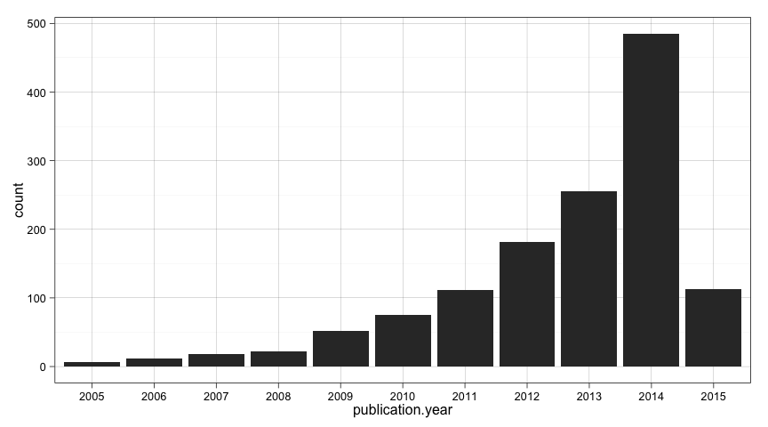
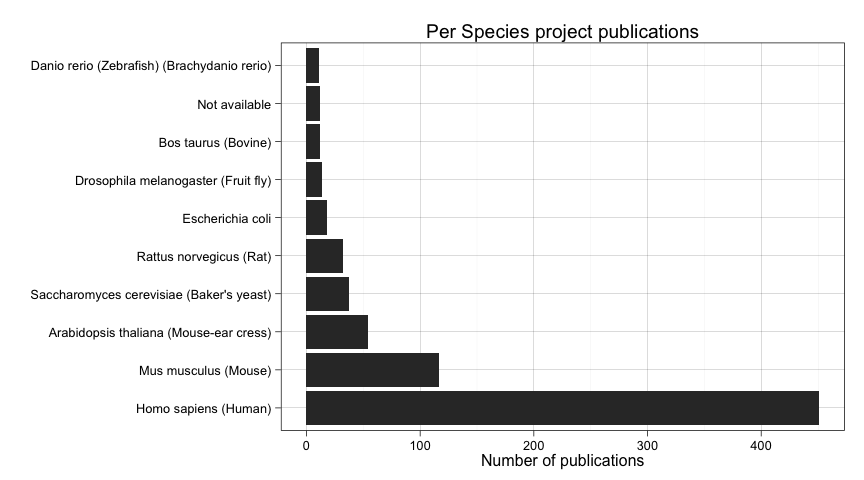
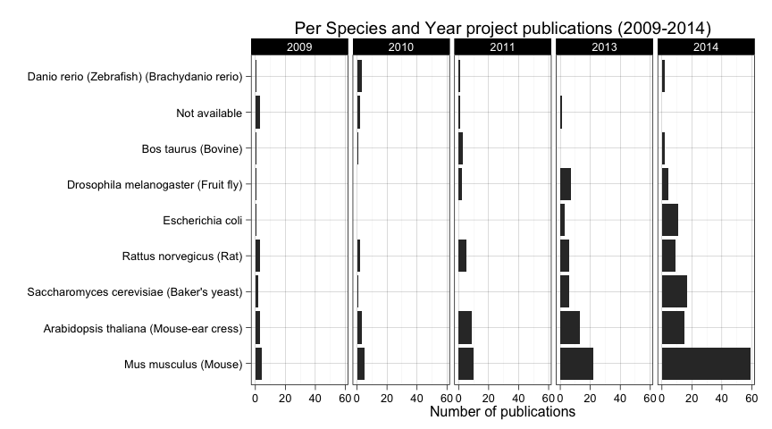

# PRIDE Archive Annual Trends - Exploratory Data Analysis
Jose A. Dianes  
20 March 2015  

# Requisites  

These are some of the libraries and configurations we will use in the 
following analysis.  


```r
require(devtools)
install_github("PRIDE-R/prideR")
library(prideR)
require(ggplot2)
theme_set(theme_linedraw())
require(dplyr)
```

# A draft of the pipeline  

The two first parts are carried out in this document. The data visualisation part
will be generated and published separately and referenced from here.  

**Data acquisition**  

We will use the [prideR package](http://pride-r.github.io/prideR) to retrieve 
data from all the submitted experiments up to date.  

**Exploratory Data Analysis**  

By using `R`, first we will prepare and explore data to be mined. Then we will
compute different summary statistics and generate some plots that will give us
some insight into the questions we want to answer in our visualisation.  

**Data Visualisation**   

For this data viz we will use [Tableau](http://www.tableau.com). We will generate some worksheets for the 
key charts, and then we will put them together in an *author-driven* linear
narrative that will go over time answering questions about MS2 proteomics 
research trends.  

# Data acquisition  

Using [prideR](http://pride-r.github.io/prideR), lets retrieve all the public 
datasets. We will use a large number as page size so we retrieve all of them.    


```r
all_projects <- search.list.ProjectSummary("",0,20000)
num_projects <- length(project.list(all_projects))
```

This time we get 1331 projects in total. Lets convert the result 
object into a data frame, more suitable to work with the different R libraries.  


```r
all_projects.df <- as.data.frame(all_projects)
names(all_projects.df)
```

```
##  [1] "accession"           "project.title"       "project.description"
##  [4] "publication.date"    "num.assays"          "species"            
##  [7] "tissues"             "ptm.names"           "instrument.names"   
## [10] "project.tags"        "submissionType"
```

Let's have a look at the publication dates.  


```r
str(all_projects.df$publication.date)
```

```
##  POSIXct[1:1331], format: "2015-03-19" "2015-03-19" "2015-03-19" "2015-03-19" ...
```

We see they are already in date format (`POSIXct`) and contain month and day. But we are just
interested in years in our study of trends, so let's extract the year in a separate
variable in the data frame.  


```r
all_projects.df$publication.year <- as.factor(format(all_projects.df$publication.date, "%Y"))
table(all_projects.df$publication.year)
```

```
## 
## 2005 2006 2007 2008 2009 2010 2011 2012 2013 2014 2015 
##    6   12   18   22   52   75  112  181  255  485  113
```

We have a lot of information in that summary table. But let's put it visually.  


```r
ggplot(data=all_projects.df, aes(x=publication.year)) +
    geom_bar()
```

 

Maybe we should exclude the present year from our trend analysis since the year
is not complete and will incorrectly influence the outcomes.  


```r
all_projects_up2014.df <- subset(all_projects.df, publication.year!="2015")
num_projects_up2014 <- nrow(all_projects_up2014.df)
```

There we are. We have a new dataframe with 1218 projects 
up to 2014. I think we are ready to start doing some Exploratory Analysis.  

# Exploratory Data Analysis  

So we know how the number of publications has changed over the years. But we are
also interested in what people research during these years. From the names in our
data frame we saw that each project includes information regarding:  

* Species  
* Tissues  
* Modification names  
* Instrument names  

Let's first have a look at each of these variables as a whole, and later on we
can group them by years. We will repeat the analysis fir each variable.    

## Species  


```r
species_table <- sort(table(all_projects_up2014.df$species), decreasing=T)
species_table_frequent <- species_table[species_table>10]
num_species <- length(species_table)
num_species_frequent <- sum(species_table>10)
```

We see that we have up to 312 different species. But most of them 
are rare species that appear just once or twice. Just 10
of them have been submitted more than ten times. Let's plot them.    


```r
ggplot(data=subset(all_projects_up2014.df, species %in% names(species_table_frequent))) + 
       aes(factor(species, levels=names(species_table_frequent))) +
    geom_bar() + coord_flip( )+
    ylab("Number of publications") +
    xlab("") +
    ggtitle("Per Species project publications")
```

 

But how this distributes over time? Let's consider just publications after 2009.  


```r
ggplot(
    data=subset(all_projects_up2014.df, 
                publication.year %in% factor(c("2009","2010","2011","2013","2014")) & 
                    species %in% names(species_table_frequent)),
       aes(
           factor(species, levels=names(species_table_frequent))
           )
    ) +
    geom_bar() + coord_flip() +
    facet_grid(. ~ publication.year) +
    ylab("Number of publications") +
    xlab("") +
    ggtitle("Per Species and Year project publications (2009-2014)")
```

 

It seems clear that human is the most prevalent species, so lets remove it so we
can compare the rest of the species more easily.  


```r
ggplot(
    data=subset(all_projects_up2014.df, 
                publication.year %in% factor(c("2009","2010","2011","2013","2014")) & 
                    species %in% names(species_table_frequent) &
                    species != "Homo sapiens (Human)"),
       aes(
           factor(species, levels=names(species_table_frequent))
           )
    ) +
    geom_bar() + coord_flip() +
    facet_grid(. ~ publication.year) +
    ylab("Number of publications") +
    xlab("") +
    ggtitle("Per Species and Year project publications (2009-2014)")
```

 

Among other things, we can see how *Mus musculus (Mouse)* has boosted its popularity
in 2014. It also seems to be a constant increase of *Rat novergicus (Rat)* over time
but it is decaying lately in favor of species such as *Escherichia coli* and 
*Saccharomyces cerevisiae (Baker's yeast)* as we can see in 2013 and 2014.  

## Tissues  

Let's repeat a similar analysis for tissues and see what we find.  


```r
tissues_table <- sort(table(all_projects_up2014.df$tissues), decreasing=T)
tissues_table_frequent <- tissues_table[tissues_table>10]
num_tissues <- length(tissues_table)
num_tissues_frequent <- sum(tissues_table>10)
```

In this case we have up to 143 different tissues. Just 
10 of them have been submitted more than ten times. 
Let's plot them.   


```r
ggplot(data=subset(all_projects_up2014.df, tissues %in% names(tissues_table_frequent))) + 
       aes(factor(tissues, levels=names(tissues_table_frequent))) +
    geom_bar() + coord_flip( )+
    ylab("Number of publications") +
    xlab("") +
    ggtitle("Per Tissues project publications")
```

 

A lot of submissions did not specify a tissue. It also happens with species, but
before wasn't so prominent. In this case we need to filter these out.  


```r
ggplot(data=
           subset(
               all_projects_up2014.df, 
               tissues %in% names(tissues_table_frequent) &
                tissues != "Not available"
               )
       ) + 
       aes(factor(tissues, levels=names(tissues_table_frequent))) +
    geom_bar() + coord_flip( )+
    ylab("Number of publications") +
    xlab("") +
    ggtitle("Per Tissues project publications")
```

 

It seems that most people use *cell cultures* as a tissue, and that makes sense.
But out of that we see some popular tissues such as *liver*, *brain*, *blood*, etc.
We will try to make sense of it later on.  

But now let's have a look at these numbers per year, again considering just 
the period 2009-2014.  


```r
ggplot(
    data=subset(all_projects_up2014.df, 
                publication.year %in% factor(c("2009","2010","2011","2013","2014")) & 
                    tissues %in% names(tissues_table_frequent) &
                tissues != "Not available"),
       aes(
           factor(tissues, levels=names(tissues_table_frequent))
           )
    ) +
    geom_bar() + coord_flip() +
    facet_grid(. ~ publication.year) +
    ylab("Number of publications") +
    xlab("") +
    ggtitle("Per Tissues and Year project publications (2009-2014)")
```

 

Two conclusions here. First, submissions started to include more metadata regarding
tissues in 2014. And second, numbers are too low actually to arrive to any conclusion
about trends out of the fact that most people uses cell cultures. Maybe *leaf* stands
out a little bit in 2014 considering it doesn't appear un the three previous years.
But again, we cannot arrive to any actual conclusions when there isn't enough submissions
containing this piece of metadata.  

## Modifications  

Our third analysis deals with what modifications are associated with a dataset.
We will repeat the same procedure.  


```r
ptm_table <- sort(table(all_projects_up2014.df$ptm.names), decreasing=T)
ptm_table_frequent <- ptm_table[ptm_table>10]
num_ptm <- length(ptm_table)
num_ptm_frequent <- sum(ptm_table>10)
```

We have up to 76 different modifications. Just 
17 of them have been submitted more than ten times. 
Let's plot them.   


```r
ggplot(data=subset(all_projects_up2014.df, ptm.names %in% names(ptm_table_frequent))) + 
       aes(factor(ptm.names, levels=names(ptm_table_frequent))) +
    geom_bar() + coord_flip( )+
    ylab("Number of publications") +
    xlab("") +
    ggtitle("Per Modification project publications")
```

 

Let's filter out unspecified modifications and plot again.  


```r
ggplot(data=
           subset(
               all_projects_up2014.df, 
               ptm.names %in% names(ptm_table_frequent) &
                ptm.names != "Not available" &
                ptm.names != "No PTMs are included in the dataset"
               ), 
       aes(factor(ptm.names, levels=names(ptm_table_frequent)))) +
    geom_bar() + coord_flip( )+
    ylab("Number of publications") +
    xlab("") +
    ggtitle("Per Modification project publications")
```

 

Three modifications stand out from the rest, specially *monohydroxylated 
residue*, but also *acetylated residue*, and *iodacetamide - site C*.    

But now let's have a look at these numbers per year, again considering just 
the period 2009-2014.  


```r
ggplot(
    data=subset(all_projects_up2014.df, 
                publication.year %in% factor(c("2009","2010","2011","2013","2014")) & 
                    ptm.names %in% names(ptm_table_frequent) &
               ptm.names != "Not available" &
                ptm.names != "No PTMs are included in the dataset"
               ),
       aes(factor(ptm.names, levels=names(ptm_table_frequent)))
    ) +
    geom_bar() + coord_flip() +
    facet_grid(. ~ publication.year) +
    ylab("Number of publications") +
    xlab("") +
    ggtitle("Per Modification and Year project publications (2009-2014)")
```

 

Here we see some trend changes. First of all, the high frequency of *monohydroxylated 
residue* seems to be a consequence of 2013 and 2014 publications. A similar thing
happens with *acetylated residue*. In the case of *iodacetamide - site C*, it is
the most frequently reported modification before 2013, but in 2013 and 2014 is less
reported. In 2014 we see an increase of submissions in *iodoacetamide derivated residue*
and *carbamidomethyl* that from being rarely reported became the third most reported
modification with 40 datasets made public
in 2014.  

## Instruments  

Finally we will have a look at what instruments have been reported to be used in
PRIDE Archive public experiments.  


```r
instrument_table <- sort(table(all_projects_up2014.df$instrument.names), decreasing=T)
instrument_table_frequent <- instrument_table[instrument_table>10]
num_instrument <- length(instrument_table)
num_instrument_frequent <- sum(instrument_table>10)
```

We have up to 164 different instrument names. Just 
17 of them have been submitted more than ten times. 
Let's plot them.   


```r
ggplot(data=subset(all_projects_up2014.df, instrument.names %in% names(instrument_table_frequent))) + 
       aes(factor(instrument.names, levels=names(instrument_table_frequent))) +
    geom_bar() + coord_flip( )+
    ylab("Number of publications") +
    xlab("") +
    ggtitle("Per Instrument project publications")
```

 

Not much here. It seems that different versions of *LTQ Orbitrap* are the most 
prevalent instrument reported.  

Lets see if there is any different in a per year chart. Again considering just 
the period 2009-2014.  


```r
ggplot(
    data=subset(all_projects_up2014.df, 
                publication.year %in% factor(c("2009","2010","2011","2013","2014")) & 
                    instrument.names %in% names(instrument_table_frequent)
               ),
       aes(factor(instrument.names, levels=names(instrument_table_frequent)))
    ) +
    geom_bar() + coord_flip() +
    facet_grid(. ~ publication.year) +
    ylab("Number of publications") +
    xlab("") +
    ggtitle("Per Instrument and Year project publications (2009-2014)")
```

 

Maybe we can mention as something interesting that *LTQ Orbitrap Velos* is
being reported more frequently in 2014 and there is also an increase of usage of
*Q Exactive* in the same year.  

# Conclusions  

In order to interpret most of these results, a good knowledge of the field is 
needed. This is needed to relate different trends in the biological data:
species, tissues, and modifications. But also it could be possible to relate 
instruments with trends in the previous?

In any case, due to the increasing popularity of PRIDE Archive 
as a proteomics experimental results repository, we will be able to see actual 
trends in the datasets in the years to come. Or at least we will be more 
confident on what has been observed here. The reason is not just that the number
of submissions is increasing, but also that the platform is being improved in order
to gather more metadata related with the experiments. Moreover, users get more 
familiar with the process, being easier for them to provide this information.  

# Data Visualisation  

As we introduced, we plan to create a data visualisation using Tableau. The idea
is to show a report for each of the years including stats for each of the
variables analysed here. The user will be able to navigate through each year
and maybe see any existing trends in the field.  

*TODO*

